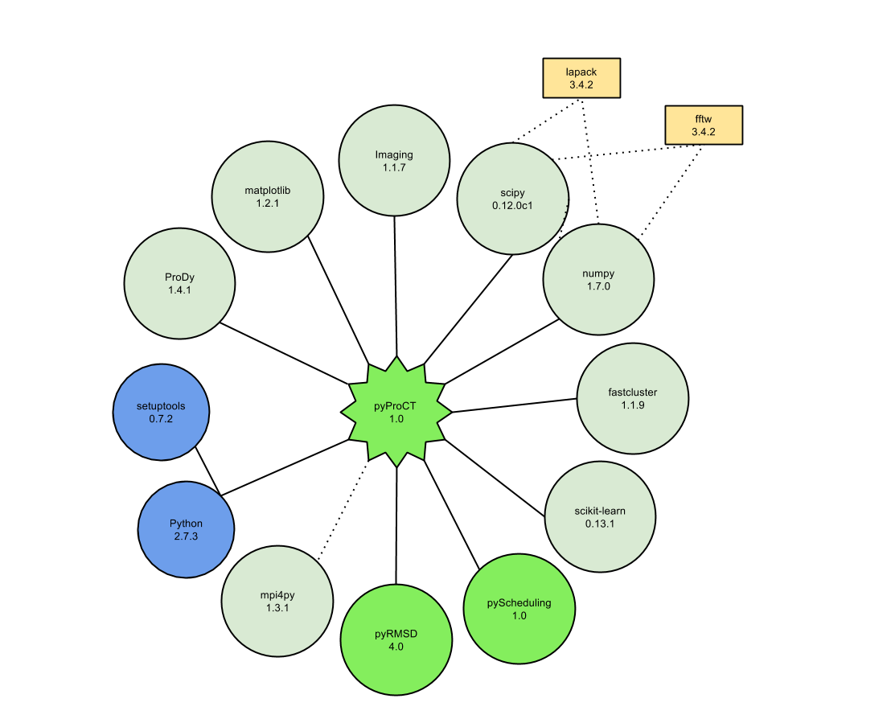

</img> If you plan to use pyProCT or any of its parts, including its documentation, to write a scientific article, 
please consider to add the following cite:  
*J. Chem. Theory Comput., 2014, 10 (8), pp 3236–3243*  

</img>  pyProCT README and docs are currently a bit outdated (some new functionalities and changes are missing) if you 
find something is not working as expected, just send me a mail to victor.gil.sepulveda@gmail.com and I will try to answer (and update the part you need) the
faster I can.

pyProCT
==========
  
pyProCT is an open source cluster analysis software especially adapted for jobs related with structural proteomics. Its approach allows users to define a clustering goal (clustering hypothesis) based on their domain knowledge. This hypothesis will guide the software in order to find the best algorithm and parameters (including the number of clusters) to obtain the result that better fulfills their expectatives. In this way users do not need to use cluster analysis algorithms as a black box, which will (hopefully) improve their results.
pyProCT not only generates a resulting clustering, it also implements some use cases like the extraction of representatives or trajectory redundance elimination.

[Table of Contents](http://doctoc.herokuapp.com/)

- [pyProCT](#user-content-pyproct)
	- [Installation](#user-content-installation)
	- [Using pyProCT as a standalone program](#user-content-using-pyproct-as-a-standalone-program)
		- [Global](#user-content-global)
		- [Data](#user-content-data)
		- [Clustering](#user-content-clustering)
			- [generation](#user-content-generation)
			- [algorithms](#user-content-algorithms)
			- [evaluation](#user-content-evaluation)
		- [Postprocessing](#user-content-postprocessing)
		- [Checking the script](#user-content-checking-the-script)
		- [Learn more](#user-content-learn-more)
	- [Using pyProCT as part of other programs](#user-content-using-pyproct-as-part-of-other-programs)
		- [Interfacing with Scikit-Learn (aka sklearn)](#user-content-using-pyproct-as-part-of-other-programs)
		- [Using it as a separate program from other Python script](#user-content-using-it-as-a-separate-program-from-other-python-script)
	- [Parallel execution](#user-content-parallel-execution)
- [Documentation](#user-content-documentation)
- [TODO](#user-content-todo)

## Installation
pyProCT is quite easy to install using *pip*. Just write:

```Shell
> sudo pip install pyProCT
```
And *pip* will take care of all the dependencies (shown below).

 </img>

</img>  It is recommended to install Numpy and Scipy before starting the installation using your OS software manager. You can try to download and install them [manually](http://docs.scipy.org/doc/numpy/user/install.html) if you dare.

</img>  mpi4py is pyProCT's last dependency. It can give problems when installing it in OS such as SUSE. If the installation of this last package is not succesful, pyProCT can still work in Serial and Parallel (using *multiprocessing*) modes.

## Using pyProCT as a standalone program

The preferred way to use pyProCT is through a JSON "script" that describes the clustering task. It can be executed using the following line in your shell:

```Shell
> python -m pyproct.main script.json
```

The JSON script has 4 main parts, each one dealing with a different aspect of the clustering pipeline. This sections are:
* _"global"_: Handles workspace and scheduler parameterization.
* _"data"_: Handles distance matrix parameterization.
* _"clustering"_: Handles algorithms and evaluation parameterization.
* _"preprocessing"_: Handles what to do with the clustering we have calculated.

```JSON
{
	"global":{},
	"data":{},
	"clustering":{},
	"postprocessing":{}
}
```

### Global
```JSON
{
	"control": {
		"scheduler_type": "Process/Parallel",
		"number_of_processes": 4
	},
	"workspace": {
		 "tmp": "tmp",
		 "matrix": "matrix",
		 "clusterings": "clusterings",
		 "results": "results",
		 "base": "/home/john/ClusteringProject"
	}
}
```
This is an example of _"global"_ section. It describes the work environment (workspace) and the type of scheduler that will be built. Defining
the subfolders of the wokspace is not mandatory, however it may be convenient in some scenarios (for instance, in serial multiple clustering
projects, sharing the _tmp_ folder would lower the disk usage as at each step it will be overwritten).

This is a valid global section using a serial scheduler and default names for workspace inner folders:
```JSON
{
	"control": {
		"scheduler_type": "Serial"
	},
	"workspace": {
		 "base": "/home/john/ClusteringProject"
	}
}
```
pyProCT allows the use of 3 different schedulers that help to improve the overall performance of the software by parallelizing some parts of the
 code. The available schedulers are "Serial", "Process/Parallel" (uses Python's [multiprocessing](https://docs.python.org/2/library/multiprocessing.html))
 and "MPI/Parallel" (uses MPI through the module [mpi4py](http://mpi4py.scipy.org/)).

####Workspace parameters

The workspace structure accepts two parameters that modify the way the workspace is created (and cleared).
_"overwrite"_ : The contents existing folders will be removed before executing.
_"clear_after_exec"_: An array containing the folders that must be removed after execution.


Example:

```JSON
"workspace": {
	 "base": "/home/john/ClusteringProject",
	 "parameters":{
		 "overwrite": true,
		 "clear_after_exec":["tmp","clusterings"]
	 }
}
```

### Data
The _"data"_ section defines how pyProCT must build the distance matrix that will be used by the compression algorithms. Currently pyProCT offers up to three options to build that matrix: "load", "rmsd" and "distance"
- _"rmsd"_: Calculates a all vs all rmsd matrix using any of the [pyRMSD](https://github.com/victor-gil-sepulveda/pyRMSD#collective-operations) calculators available. It can calculate the RMSD of the fitted region (defined by [Prody](http://prody.csb.pitt.edu/) compatible selection string in _fit_selection_) or one can use one selection to superimpose and another to calculate the rmsd (_calc_selection_).
There are two extra _parameters_ that must be considered when building an RMSD matrix.
	- _"type"_: This property can have two values: _"COORDINATES"_ or _"DIHEDRALS"_. If _DIHEDRALS_ is chosen, each element _(i,j)_ of the distance matrix will be the RMSD of the arrays containing the phi-psi dihedral angle series of conformation _i_ and _j_.
	- _"chain_map"_: If set to _true_ pyProCT will try to reorder the chains of the biomolecule in order to minimize the global RMSD value. This means that
	it will correctly calculate the RMSD even if chain coordinates were permuted in some way. The price to pay is an increase of the calculation time (directly proportional to the number of chains or the number of chains having the same length).
- _"distance"_: After superimposing the selected region it calculates the all vs all distances of the geometrical center of the region of interest (_body_selection_).
- _"load"_: Loads a precalculated matrix.

JSON chunk needed to generate an RMSD matrix from two trajectories:
```JSON
{
	"type": "pdb_ensemble",
	"files": [
		"A.pdb",
		"B.pdb"
	],
	"matrix": {
		"method": "rmsd",
		"parameters": {
			"calculator_type": "QCP_OMP_CALCULATOR",
			"fit_selection": "backbone"
		},
		"image": {
			"filename": "matrix_plot"
		},
		"filename":"matrix"
	}
}
```
JSON chunk to generate a dihedral angles RMSD matrix from one trajectories:
```JSON
{
	"type": "pdb_ensemble",
	"files": [
		"A.pdb"
	],
	"matrix": {
		"method": "rmsd",
		"parameters": {
			"type":"DIHEDRAL"
		},
		"image": {
			"filename": "matrix_plot"
		},
		"filename":"matrix"
	}
}
```

The matrix can be stored if the _filename_ property is defined. The matrix can also be stored as an image if the _image_ property is defined.

pyProCT can currently load _pdb_ and _dcd_ files. The details to load the files must be written into the array under the "files" keyword. There are
many ways of telling pyProCT the files that have to be load and can be combined in any way you like:

1 - Using a list of file paths. If the file extension is ".txt" or ".list" it will be treated as a pdb list file. Each line of such files will
be a pdb path or a pdb path and a selection string, separated by comma.

```
A.pdb, name CA
B.pdb
C.pdb, name CA
...
```
2 - Using a list of file objects:
```JSON
{
	"file": ... ,
	"base_selection": ...
}
```
Where _base_selection_ is a [Prody](http://prody.csb.pitt.edu/) compatible selection string. Loading files this way can help in cases where not all files have structure with the same number of atoms: _base_selection_ should define the common region between them (if a 1 to 1 map does not exist, the RMSD calculation will be wrong).

3 - Only for _dcd_ files:
```JSON
{
	"file": ...,
	"atoms_file": ...,
	"base_selection": ...
}
```
Where _atoms_file_ is a _pdb_ file with at least one frame that holds the atomic information needed by the _dcd_ file.

_*Note*: data.type is currently unsused_

### Clustering
The _clustering_ section specifies how the clustering exploration will be done. It is divided in 3 other subsections:

```JSON
{
	"generation": {
		"method": "generate"
	},
	"algorithms": {
		...
	},
	"evaluation": {
		...
	}
}
```
#### Generation
Defines how to generate the clustering (_"load"_ or _"generate"_). if _"load"_ is chosen, this section will also contain the clustering
that may be used in the _"clusters"_ property. Ex.:

```JSON
{
	"clustering": {
		"generation": {
			"method" : "load",
			"clusters": [
					{
						"prototype " : 16,
						"id": "cluster_00",
						"elements" : "9, 14:20"
					},
					{
						"prototype": 7,
						"id": "cluster_01",
						"elements": "0:8, 10:14, 21"
					}
			]
		}
}
```

#### Algorithms
If clustering.generation.method equals "generate", this section defines the algorithms that will be used as well as their parameters (if
necessary). The currently available algorithms are : _"kmedoids"_, _"hierarchical"_, _"dbscan"_, _"gromos"_, _"spectral"_ and _"random"_.
Each algorithm can store its list of parameters, however the preferred way to work with pyProCT is to let it automatically generate them.
Almost all algorithms accept the property _max_, that defines the maximum amount of parameter collections that will be generated for that
algorithm. Ex.

```JSON
{
	"kmedoids": {
		"seeding_type": "RANDOM",
		"max": 50,
		"tries": 5
	},
	"hierarchical": {

	},
	"dbscan": {
		"max": 50
	},
	"gromos": {
		"max": 50
	},
	"spectral": {
		"max": 50,
		"force_sparse":true
	}
}
```

Algorithm parameters can be explicitly written, however it is not recommended:

```JSON
{
	"kmedoids": {
		"seeding_type": "RANDOM",
		"max": 50,
		"tries": 5,
		"parameters":[{"k":4},{"k":5},{"k":6}]
	}
}
```

#### Evaluation
This section holds the _Clustering Hypothesis_, the core of pyProCT. Here the user can define how the expected clustering will be. First the user
 must set the expected number of clusters range. Also, an estimation of the dataset noise and the cluster minimum size (the minimum number of
 elements a cluster must have to not be considered noise) will complete the quantitative definition of the target result.

Ex.
```JSON
{
	"maximum_noise": 15,
	"minimum_cluster_size": 50,
	"maximum_clusters": 200,
	"minimum_clusters": 6,
	"query_types": [ ... ],
	"evaluation_criteria": {
		...
	}
}
```

The second part of the _Clustering Hypothesis_ tries to characterize the clustering internal traits in a more qualitative way. Concepts like
cluster "Compactness" or "Separation" can be used here to define the expected clustering. To this end users must write their expectations in
form of _criteria_. This criteria are, in general, linear combinations of Internal Clustering Validation Indices (ICVs). The best clustering
will be the one that gets the best score in any of these _criteria_. See chapter 2 of [this document](https://dl.dropboxusercontent.com/u/58918851/pyProCT-SupportingInformation.pdf)
to get more insight about the different implemented criteria and their meaning.

Additionally users may choose to ask pyProCT about the results of this ICVs and other evaluation functions(e.g. the average cluster size) by adding
 them to the _queries_ array.

```JSON
{
		...
	"query_types": [
	    "NumClusters",
	    "NoiseLevel",
	    "MeanClusterSize"
	],
	"evaluation_criteria": {
	    "criteria_0": {
	        "Silhouette": {
	            "action": ">",
	            "weight": 1
	        }
	    }
	}
}
```

### Postprocessing
Getting a good quality clustering is not enough, we would like to use them to extract useful information. pyProCT implements some use cases that may help
 users to extract this information.

```JSON
{
	"rmsf":{},

	"centers_and_trace":{},

	"representatives":{
		"keep_remarks": [true/false],
		"keep_frame_number": [true/false]
	},

	"pdb_clusters":{
		"keep_remarks": [true/false],
		"keep_frame_number": [true/false]
	},

	"compression":{
		"final_number_of_frames": INT,
		"file": STRING,
		"type":[‘RANDOM’,’KMEDOIDS’]
	},

	"cluster_stats":{
		"file": STRING
	},


	"conformational_space_comparison":{},

	"kullback_liebler":{}
}
```
- _"rmsf"_ : Calculates the global and per-cluster (and per-residue) root mean square fluctuation (to be visualized using the [GUI](https://github.com/victor-gil-sepulveda/pyProCT-GUI)).

- _"centers_and_trace"_ : Calculates all geometrical centers of the calculation selection of the system (to be visualized using the [GUI](https://github.com/victor-gil-sepulveda/pyProCT-GUI)).

- _"representatives"_ : Extracts all the representatives of the clusters in the same pdb.
	Parameters:
	- _"keep_remarks"_: If true every stored model will be written along with its original remarks header. Default: false.
	- _"keep_frame_number"_: If true, the model number of any stored conformation will be the original pdb one. Default: false.

- _"pdb_clusters"_ : Extracts all clusters in separate pdbs.
	Parameters:
	- _"keep_remarks"_: If true every stored model will be written along with its original remarks header. Default: false.
	- _"keep_frame_number"_: If true, the model number of any stored conformation will be the original pdb one. Default: false.

- _"compression"_ : Reduces the redundancy of the trajectory using the resulting clustering.
	Parameters:
	- _"file"_: The name of the output file without extension. Default "compressed"(.pdb)
	- _"final_number_of_frames"_: The expected (minimum) number of frames of the compressed file.
	- _"type"_: The method used to get samples from each cluster. Options:
		- "RANDOM": Gets a random sample of the elements of each cluster.
		- "KMEDOIDS": Applies the k-medoids algorithm to the elements of a cluster and stores the representatives.
		Default: "KMEDOIDS".

- _"cluster_stats"_: Generates a human readable file with the distances between cluster centers and their diameters.
	Parameters:
	- _"file"_: The name of the output file without extension (will be sotred into the results folder). Default: "per_cluster_stats"(.csv).

- _"conformational_space_comparison"_ : Work in progress.

- _"kullback_liebler"_ : Work in progress.

### Script validation
As the control script is indeed holding a JSON object, any JSON validator can be used to discover the errors in case of script loading problems. A good example
of such validators is [JSONLint](http://jsonlint.com/).
pyProCT scripts accept javascript comments ( // and /* */)

## </img>  Using pyProCT as part of other programs

* Using algorithms
* Clustering from label lists
* Using ICVs with custom clusterings
* Performing the whole protocol
```Python
Driver(Observer()).run(parameters)
```

The necessary documentation to use pyProCT classes is written inside the code. It has been extracted [here](pyproct/docs/_build/html/index.html) and [here](pyproct/docs/doxyxml/html/index.html). We are currently trying to improve this documentation with better explanations and examples.

See [this file](https://github.com/victor-gil-sepulveda/pyProCT/blob/master/validation/bidimensional/validation_main.py).

### Interfacing with Scikit-Learn (aka sklearn)

```Python
import numpy.random
import sklearn.cluster

# Imports needed for the matrix
import scipy.spatial.distance as distance

# Imports needed for the conversion
from pyproct.clustering.cluster import gen_clusters_from_class_list
from pyproct.clustering.clustering import Clustering

# Imports needed for the calculation
from pyRMSD.condensedMatrix import CondensedMatrix
from pyproct.clustering.metrics.DaviesBouldin import DaviesBouldinCalculator

# Plotting
import matplotlib.cm as cm
from pylab import *

if __name__ == "__main__":
    # This uses sklearn to create a clustering in label form.
    dataset = numpy.random.rand(1000,2)*100
    clustering_labels = sklearn.cluster.KMeans(10).fit_predict(dataset)

    # Importing the clustering. Calculating the cluster prototypes is not needed
    # for the calculation, but this piece of code shows how to do it. In addition
    # it whows how tto calculate the distance matrix, which in this case is needed by
    # the scoring function.
    distance_matrix = CondensedMatrix(distance.pdist(dataset))
    pyproct_clustering = Clustering(gen_clusters_from_class_list(clustering_labels))

    for cluster in pyproct_clustering.clusters:
        cluster.set_prototype(cluster.calculate_medoid(distance_matrix))

    # Using Davies-Boulding; distance matrix is necessary.
    print "Davies - Bouldin score: %f"%(DaviesBouldinCalculator().evaluate(pyproct_clustering, distance_matrix))

    # Showing the clustering
    colors = iter(cm.rainbow(np.linspace(0, 1, len(pyproct_clustering.clusters))))
    for cluster in pyproct_clustering.clusters:
        coordinates = dataset[cluster.all_elements]
        scatter(coordinates.T[0], coordinates.T[1], color=next(colors))

    show()
```

### Using it as a separate program from other Python script

* </img>  Loading results
* </img>  Generating scripts programatically

See [this project](https://github.com/victor-gil-sepulveda/PhD-GPCR) for some examples.

## Parallel execution
To execute pyProCT in parallel you just need to issue this line:

```Shell
> mpirun -np NumberOfProcesses -m pyproct.main --mpi script.json
```

</img>  When running pyProCT using MPI you will need to use the _MPI/Parallel_ Scheduler or it will just execute several independent serial runs.

</img>  Remember that you need to use the same libraries and versions to build mpi4py and mpirun, otherwise you won't be able to execute it.

# Documentation
</img>  pyProCT README and docs are currently a bit outdated (some new functionalities and changes are missing) if you 
find something is not working as expected, just send me a mail to victor.gil.sepulveda@gmail.com and I will try to answer (and update the part you need) the
faster I can. The [Sphinx](http://sphinx-doc.org/)-based documentation is (verly) slowly being written. Meanwhile I have updated section 2 of the
supplementary materials (free access) from the paper. This document can be downloaded [here](https://dl.dropboxusercontent.com/u/58918851/pyProCT-SupportingInformation.pdf).
Note that chapter 3 may be outdated.
  
### Learn more
Please, do not hesitate to send a mail to victor.gil.sepulveda@gmail.com with your questions, criticisms and whatever you think it is not working
or can be done better. Any contribution can help to improve this software!

# Improvements (TODO)

- [ ] To improve this documentation (better explanations, more examples and downloadable scripts).

### Refactoring and general improvements:  
- [ ] When loading more than one file, the first loaded file becomes the template for subsequent selections. If
the number of atoms or the ordering of the next loaded files is different from the first one, the RMSD calculation
can fail. Find a method to reorder the atoms.
- [ ] Total refactoring (Clustering and Clusters are inmutable, hold a reference to the matrix -> prototypes are always updated)  
- [x] Data refactoring (Create a wrapper that stores the prody object, temporary selection storage, etc...)  
- [ ] Rename script stuff  
- [ ] Rename functions and vars  
- [ ] Minimizing dependencies with scipy  
- [ ] Minimizing dependencies with prody (create an standalone reader)  
- [ ] Add its own Hierarchical clustering code (educational motivations)  
- [ ] Improve spectral algorithm (add more tests - comparisons with other implementations, adding new types)  
- [ ] Improve MPI load balance (i.e. parameter generation must be processed in parallel)  
- [ ] Check current tests. Improve test coverage  
- [ ] The script must accept numbers and percentages  
- [ ] Use JSON schema to validate the script. Try to delegate the full responsibility of validating to pyProCT (instead of the GUI)    
- [x] Users must be able to comment their scripts (with '//' for instance).  
- [x] When loading a dcd file, we only want to load atomic data of the the associated pdb.  
- [ ] Change "compression" by "redundancy_elimination"  
- [x] Allow to load all files (or [glob](https://docs.python.org/3.1/library/glob.html)) from a folder.  
- [ ] Plotting distance matrix distances distribution.  
- [ ] Change errors to std. error. Add logs.  
- [ ] Improve postprocessing actions (must take advantage of new data layout).  
- [x] Rename 'get_structure_ensemble' by get_inner_data (add virtual function too). Finally changed to 'get_all_elements'    

### Specific improvements 
####Symetry handling:  
- [ ] Symmetry handling for fitting coordinates.
- [ ] Improve symmetry handling for calculation coordinates (e.g. ligands).
- [x] Simple chain mapping feature.

####New algorithms:
- [ ] Modularity-based (Newman J. 2003)
- [ ] Passing messages (Frey and Dueck 2007)
- [ ] Flow simmulation (Stijin van Dongen)
- [ ] Fuzzy Clustering
- [ ] [Jarvis-Patrick Algorithm](http://www.improvedoutcomes.com/docs/WebSiteDocs/Clustering/Jarvis-Patrick_Clustering_Overview.htm)
- [ ] Others (adaptative spectral clustering flavours)

####New quality functions.
- [ ] Balancedness: The sizes of the clusters must be balanced.
- [ ] J quality function: Cai Xiaoyan Proceedings of the 27th Chinese Control Conference
- [ ] Metastability function (Q) in Chodera et al. J. Chem. Phys. 126 155101 2007 .
- [ ] New Davies-Bouldin (http://www.litrp.cl/ccpr2014/papers/jcc2014_submission_131.pdf)
- [ ] Improve separation quality functions.
- [ ] New standard separation ICVs (require inmutable prototypes)

	>
	>Separation, the clusters themselves should be widely spaced. There are three common approaches measuring the distance between two different clusters:
	>-  Single linkage: It measures the distance between the closest members of the clusters.
	>-  Complete linkage: It measures the distance between the most distant members.
	>- Comparison of centroids: It measures the distance between the centers of the clusters.

####New features:
- [ ] Refine noise in DBSCAN
- [ ] Refine a preselected cluster (e.g "noise"), or "heterogeneous".
- [ ] TM-Score

####New postprocessing options:
- [ ] Refinement  
- [ ] Kinetic analysis  
